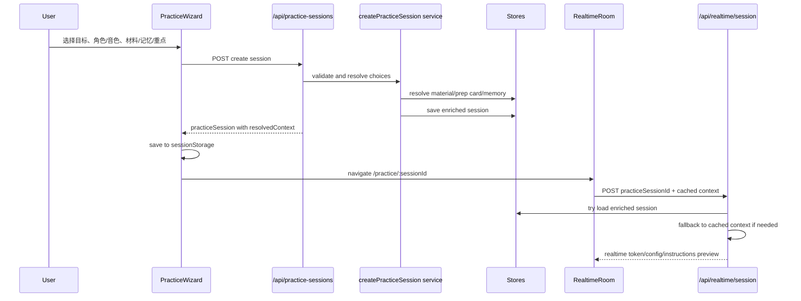

# 今日训练三步创建后端配置 SDD

日期：2026-05-23

## 1. 背景

「今日训练 / 创建一次练习」已经有完整前端三步流程：

1. 选择练习目标：客户问答、演示讲解、异议处理、方案会议、60 秒快速表达。
2. 选择 AI 客户角色和 AI Studio 音色。
3. 选择材料/记忆来源和训练重点。

当前问题是：前端能选中按钮，也会调用 `/api/practice-sessions`，但后端只是把前端字段原样保存为一个基础 session。材料、记忆、训练重点、角色/音色解析没有形成可复用的后端上下文，导致后续实时对话、提示、复盘并不能稳定使用这些选择。

最明显的现状缺陷：

- `recent_material`、`memory_context` 被当成普通 `materialId` 保存，而不是解析为「最近材料」或「系统记忆」。
- 后端没有生成或绑定 `materialBrief`、`prepCard`、`memorySnippets`。
- `focusTags` 只是保存字符串，没有扩展为实时对话可用的训练指令。
- `/practice/[sessionId]` 依赖内存 session，在 Vercel serverless 场景下不可靠；客户端 sessionStorage 才是当前主要兜底。
- 实时会话 `/api/realtime/session` 只能使用请求体中的基础字段，无法根据 `practiceSessionId` 拉取完整训练上下文。

## 2. 目标

本任务目标是把三步选择从「前端状态」升级为「后端可识别、可验证、可传给实时对话和复盘的训练配置」。

成功后，用户选择的目标、角色、音色、材料/记忆、训练重点必须真实影响：

- 实时 AI 客户的人设、追问方式和业务重点。
- Gemini Live 的 `voice_name`。
- 实时对话 prompt 中可用的材料 brief、prep card、记忆片段和训练重点。
- 后续提示模块、建议回答、复盘和表达库沉淀。

## 3. 非目标

本轮不解决以下问题：

- 不重构整套 UI。
- 不新增文件上传入口。
- 不替换实时语音底层模型。
- 不完整迁移到 Supabase 数据库，但设计要预留持久化接口。
- 不在实时音频循环中调用 DeepSeek；DeepSeek 仍用于文本分析、材料整理、提示和复盘。

## 4. 核心设计

### 4.1 新增后端创建服务

新增一个服务层，建议文件：

`src/lib/practice/create-practice-session.ts`

职责：

- 校验三步选择是否合法。
- 根据材料选择模式解析真实材料、准备卡和记忆。
- 根据练习目标和训练重点生成可读的训练指令。
- 保存 enriched practice session。
- 返回前端可缓存、实时会话可复用的完整上下文。

后续如果迁移到 Supabase，只需要替换 store 层，不需要改前端 wizard 和 realtime prompt 构造逻辑。

### 4.2 输入模型

当前 `materialId` 同时承担「具体材料 ID」和「材料模式」两种含义，需要拆开。

建议新增字段：

```ts
type MaterialMode =
  | "recent_material"
  | "no_material"
  | "memory_context"
  | "specific_material";

type CreatePracticeSessionRequest = {
  scenarioPackId: string;
  goalId: string;
  mode: string;
  personaId: string;
  voicePackId: string;
  materialMode: MaterialMode;
  materialId?: string;
  prepCardId?: string;
  difficulty: "easy" | "normal" | "hard" | "executive";
  focusTags: string[];
  trainingFocus: string[];
  sourceObjectionId?: string;
};
```

前端规则：

- 选「最近客户材料」：发送 `materialMode: "recent_material"`，不发送假 `materialId`。
- 选「不使用材料」：发送 `materialMode: "no_material"`。
- 选「使用系统记忆」：发送 `materialMode: "memory_context"`。
- 如果未来支持选择具体材料：发送 `materialMode: "specific_material"` + `materialId`。

### 4.3 输出模型

`POST /api/practice-sessions` 返回 enriched session：

```ts
type ResolvedPracticeContext = {
  goal: {
    id: string;
    label: string;
    description: string;
  };
  persona: {
    id: string;
    label: string;
    communicationStyle: string;
    focusAreas: string[];
    rolePrompt: string;
  };
  voicePack: {
    id: string;
    name: string;
    providerVoiceName: string;
    gender: "female" | "male";
    personality: string;
    voiceStyle: string;
    modelVoiceHint: string;
  };
  material: {
    mode: MaterialMode;
    materialId?: string;
    prepCardId?: string;
    materialName?: string;
    materialBriefSummary?: string;
    prepCardSummary?: string;
    resolutionStatus:
      | "resolved"
      | "not_found"
      | "not_requested"
      | "fallback_to_memory";
  };
  focus: {
    tags: string[];
    realtimeInstructions: string[];
    reviewDimensions: string[];
  };
  memorySnippets: string[];
};

type PracticeSessionRecord = CreatePracticeSessionRequest & {
  id: string;
  status: "created" | "active" | "completed" | "reviewed";
  resolvedContext: ResolvedPracticeContext;
  createdAt: string;
  updatedAt: string;
};
```

### 4.4 材料与记忆解析

材料模式解析策略：

| 模式 | 解析策略 | 失败兜底 |
| --- | --- | --- |
| `recent_material` | 从 `listMaterialRecords()` 取最近 ready 材料；优先绑定已有 `materialBrief` 和最近的 `prepCard` | 没有材料时改为 `fallback_to_memory`，使用系统记忆和通用场景 |
| `specific_material` | 根据 `materialId` 查找材料；绑定 brief 和 prep card | 未找到返回 400，不静默降级 |
| `memory_context` | 使用 `rankMemoriesForPractice({ focusTags })` 取相关记忆 | 无记忆时使用默认场景提示 |
| `no_material` | 不绑定材料，不注入材料 brief | 使用目标、角色、训练重点生成通用对话 |

记忆片段格式建议：

```ts
`${memory.title}: ${memory.summary}`
```

每次创建练习最多注入 5 条，按相关性、时间、重要性和置信度排序。

### 4.5 训练重点解析

`focusTags` 需要转换为 AI 可执行指令，而不是只保存中文标签。

建议维护映射：

```ts
const focusInstructionMap = {
  "商业价值": "Push the learner to connect product features to business value and customer workflow outcomes.",
  "隐私安全": "Ask about privacy, data flow, security boundaries, and unsupported claims.",
  "试点推进": "Guide the learner toward a concrete pilot scope, success metric, owner, and next step.",
  "简短回答": "Require concise answers before allowing elaboration.",
  "探索式提问": "Reward discovery questions that clarify use case, decision process, and constraints.",
  "产品演示表达": "Ask the learner to explain features through a customer-facing demo story.",
  "应用场景说明": "Ask for concrete application scenarios and who benefits from them.",
  "优缺点对比": "Ask for balanced pros, cons, and fit boundaries.",
  "竞品差异": "Ask for safe differentiation versus alternative products or workflows.",
  "产品参数解释": "Ask for precise product parameters and limits without inventing unsupported facts."
};
```

若用户没有选择训练重点：

- 使用练习目标默认重点。
- 再结合 persona focusAreas 自动补充 1-2 个重点。

### 4.6 API 行为

#### POST `/api/practice-sessions`

流程：

1. 解析并校验请求体。
2. 根据 `scenarioPackId` 查找场景包。
3. 校验 `goalId`、`personaId`、`voicePackId` 是否属于当前场景包。
4. 解析材料、准备卡和记忆。
5. 解析训练重点。
6. 保存 enriched practice session。
7. 返回 `{ practiceSession }`。

错误响应：

- 无效 goal/persona/voice：400。
- `specific_material` 但材料不存在：404 或 400。
- 其他内部错误：500，并返回中文可读错误。

#### POST `/api/realtime/session`

需要增强为：

- 支持 `practiceSessionId`。
- 优先从 `practiceSessionId` 查找 enriched session。
- 如果 serverless 内存丢失，则使用前端传入的 cached session context 兜底。
- 最终调用 `buildRealtimeInstructions` 时必须带上：
  - `goalId/mode`
  - `persona`
  - `voicePack.providerVoiceName`
  - `materialBrief`
  - `prepCard`
  - `focusTags`
  - `memorySnippets`

### 4.7 前端调整点

`PracticeWizard` 只需要做轻量调整：

- 用 `selectedMaterialMode` 替代现在的 `selectedMaterialId`。
- 最终 payload 发送 `materialMode`。
- 保存 sessionStorage 时保存后端返回的 enriched session。
- 跳转逻辑保持 `/practice/${id}`。

`RealtimeRoom` 调用 realtime session 时：

- 继续读取 sessionStorage。
- 带上 `practiceSessionId`。
- 带上 cached `resolvedContext.memorySnippets` 作为 serverless 兜底。

### 4.8 数据持久化策略

短期：

- 保持当前内存 store。
- 前端 sessionStorage 存完整 enriched session 作为当前浏览器会话兜底。

中期：

- 抽象 `PracticeSessionRepository`：
  - `createPracticeSession`
  - `getPracticeSession`
  - `listPracticeSessions`
  - `updatePracticeSessionStatus`
- 当前实现使用 Map。
- Supabase 实现后替换 repository。

生产注意：

- Vercel serverless 内存不保证跨请求稳定。
- 一旦进入多用户或真实长期使用，practice session、material、prep card、memory 必须迁移到 Supabase。

### 4.9 第二步角色与音色配置

「让 AI 扮演谁」不能只依赖前端卡片。每个角色、每个音色都需要独立配置文件，后端创建 session 时必须解析这些配置。

配置目录：

```text
src/config/scenarios/rokid-overseas-sales/
  roles.ts
  voice-packs.ts
  role-voice-rules.ts
  index.ts
```

角色配置必须包含：

- `id`、`label`、`englishName`
- `communicationStyle`、`pressureLevel`
- `focusAreas`
- `openingQuestions`
- `followUpPatterns`
- `challengeRules`
- `defaultFocusTags`
- `rolePrompt`

音色配置必须包含：

- `id`、`name`
- Gemini AI Studio `providerVoiceName`
- `gender`、`personality`、`voiceStyle`、`speed`
- `bestFor`
- `modelVoiceHint`
- `geminiLiveConfig`，其中必须包含：

```ts
{
  response_modalities: ["AUDIO"],
  speech_config: {
    voice_config: {
      prebuilt_voice_config: {
        voice_name: "Kore"
      }
    }
  }
}
```

角色和音色之间需要配置推荐规则：

- `roleId`
- `defaultVoicePackId`
- `recommendedVoicePackIds`

后端创建 session 时：

- 根据 `personaId` 解析完整角色配置。
- 根据 `voicePackId` 解析完整音色配置。
- 将角色和音色放入 `resolvedContext`。
- realtime session 优先使用创建 session 时的 `resolvedContext`。
- Gemini Live 使用 `voicePack.providerVoiceName` 作为最终 `voice_name`。

## 5. 关键流程



## 6. 验收标准

### 功能验收

- 选择不同练习目标后，创建出的 session 中 `goalId/mode/resolvedContext.goal` 不同。
- 选择不同客户角色后，实时 prompt 中的 persona rolePrompt 和沟通风格不同。
- 选择不同 AI Studio 音色后，实时 Gemini config 使用对应 `voice_name`。
- 选择「最近客户材料」不会把 `recent_material` 当作 `materialId`，而是解析真实最近材料或给出明确兜底状态。
- 选择「不使用材料」时，实时 prompt 不注入材料 brief。
- 选择「使用系统记忆」时，实时 prompt 注入 memory snippets。
- 训练重点会变成实时对话指令，而不仅是中文标签。

### 技术验收

- API tests 覆盖三步选择的后端解析。
- Unit tests 覆盖材料模式解析、训练重点映射、记忆排序调用。
- Wizard tests 覆盖前端发送 `materialMode` 而不是假 `materialId`。
- Realtime session tests 覆盖 `practiceSessionId` 和 cached context 两条路径。
- `npm run typecheck`、`npm run lint`、相关测试、`npm run build` 通过。
