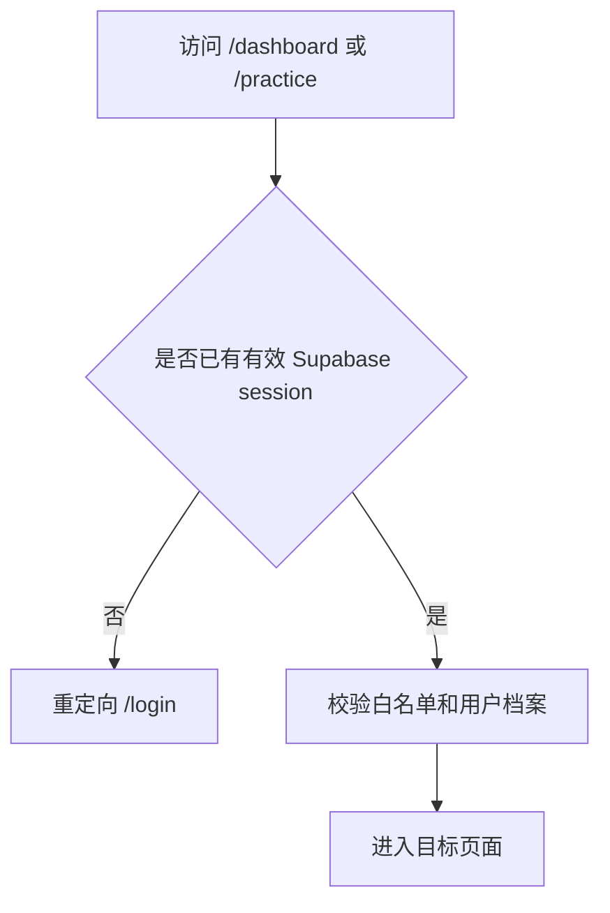
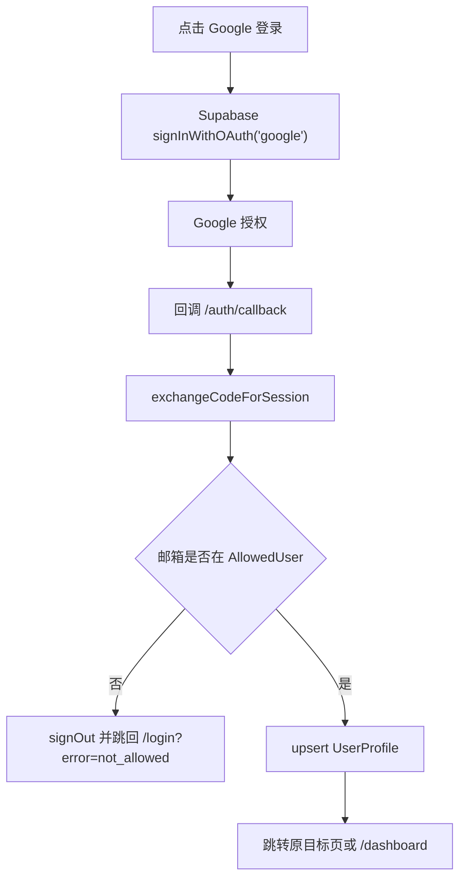

# 账号与数据隔离第一阶段 SDD

日期：2026-05-24

## 1. 背景

当前网站已经具备材料上传、实时练习、表达库、记忆、复盘和长期统计等能力，但账号体系还没有真正建立。随着材料、对话、复盘和长期记忆逐步变成真实数据，系统必须先解决四件事：

1. 谁可以使用这个网站。
2. 每条数据属于哪个用户。
3. 用户不能读取或修改其他人的数据。
4. 后续接入 Google、微信等快捷登录时，不破坏数据隔离模型。

第一阶段先建立最小但安全的账号与权限地基：Supabase Auth、白名单邮箱、Google 快捷登录、`userId` 数据隔离、RLS 权限策略。微信快捷登录可以接入，但不适合放在第一阶段一起完成，因为微信 Web 登录通常不稳定提供邮箱，白名单模型需要从“邮箱白名单”扩展为“第三方身份白名单或邀请码绑定”。

## 2. 第一阶段目标

第一阶段完成后，系统应具备：

- 用户必须登录后才能访问主要页面和业务 API。
- 用户只能使用白名单邮箱登录。
- 支持 Google 快捷登录。
- 支持邮箱登录入口，为后续密码登录或 magic link 留接口。
- 登录成功后自动创建或更新用户档案。
- 所有用户私有数据具备明确的 `userId` 归属。
- 数据库开启 RLS，禁止跨用户读取、修改、删除数据。
- 前端、API、数据库三层都能从同一个 Supabase Auth 用户 ID 推导出同一个站内用户档案。

## 3. 非目标

第一阶段不做：

- 微信快捷登录的完整实现。
- 组织、团队、角色权限、管理员后台。
- 付费订阅、套餐、用量计费。
- 完整账号中心，包括修改密码、删除账号、设备管理等。
- 把所有 in-memory store 一次性替换为 Prisma/Supabase 持久化存储。
- 复杂审计日志和安全风控。

但第一阶段必须把身份模型设计正确，使后续迁移业务数据到数据库时不需要再次重构用户归属字段。

## 4. 设计原则

### 4.1 使用 Supabase Auth 作为唯一身份源

系统登录身份以 Supabase Auth 的 `auth.users.id` 为准。这个 ID 是 UUID，写入 `UserProfile.authUserId`。

为了兼容当前 Prisma schema 和已有迁移，`UserProfile.id` 第一阶段继续保留现有站内主键，业务表的 `ownerId/userId` 继续引用 `UserProfile.id`。服务端通过 `authUserId` 找到 `UserProfile.id`，再用这个站内 profile id 过滤业务数据。

不再使用前端写死的 `demo_user`、`user_123` 或客户端传入的用户 ID 作为真实用户身份。

### 4.2 白名单是准入控制，不是 UI 提示

白名单必须在服务端校验。前端可以展示“该邮箱不在白名单”的提示，但不能只依赖前端阻止。

### 4.3 RLS 是最后防线

即使 API 层遗漏了过滤条件，数据库 RLS 也要确保用户只能访问自己的数据。

### 4.4 不用用户可修改字段做权限判断

不能用 `raw_user_meta_data` 或用户可编辑资料做授权判断。白名单和权限判断使用服务端表、`auth.uid()`、受控字段或服务端逻辑。

### 4.5 Service Role 永不进入浏览器

`SUPABASE_SERVICE_ROLE_KEY` 只允许在服务端模块使用，不能放进任何 `NEXT_PUBLIC_` 环境变量，也不能传给客户端组件。

## 5. 第一阶段用户流程

### 5.1 首次访问



### 5.2 Google 登录



### 5.3 邮箱登录

邮箱登录入口保留为第一阶段能力，但默认可以先以 magic link 形式实现：

1. 用户输入邮箱。
2. 前端调用服务端预检查接口。
3. 服务端确认邮箱在白名单后，再调用 Supabase 邮箱登录。
4. 不在白名单则不发送登录邮件。

如果后续需要账密登录，可以在同一白名单模型上增加密码注册和登录。

## 6. 数据模型

### 6.1 AllowedUser

用于管理允许访问网站的用户。

```prisma
enum AllowedUserStatus {
  INVITED
  ACTIVE
  BLOCKED
}

model AllowedUser {
  id          String            @id @default(cuid())
  email       String            @unique
  status      AllowedUserStatus @default(INVITED)
  invitedBy   String?
  invitedAt   DateTime          @default(now())
  activatedAt DateTime?
  notes       String?
  createdAt   DateTime          @default(now())
  updatedAt   DateTime          @updatedAt

  @@index([status])
}
```

约束：

- `email` 入库前统一 trim + lowercase。
- `BLOCKED` 用户即使曾登录过，也不能继续进入业务页面。
- 第一阶段可以通过 seed 或 Supabase SQL 手动维护白名单。

### 6.2 UserProfile

`UserProfile` 新增 `authUserId` 字段绑定 Supabase Auth 用户。这样可以避免破坏当前 `UserProfile.id -> Material/PracticeSession/Phrase` 的既有关联。

```prisma
model UserProfile {
  id                  String            @id @default(cuid())
  authUserId          String?           @unique @db.Uuid
  email               String?           @unique
  name                String
  avatarUrl           String?
  role                String
  englishLevel        String            @default("B2")
  trainingPreferences Json              @default("{}")
  createdAt           DateTime          @default(now())
  updatedAt           DateTime          @updatedAt
  materials           Material[]
  prepCards           PrepCard[]
  practiceSessions    PracticeSession[]
  phrases             Phrase[]
  weaknesses          WeaknessMetric[]
}
```

说明：

- 登录用户的 `authUserId` 等于 `auth.users.id`。字段在迁移期允许为空，用于兼容已有 demo/profile 数据；真实登录用户必须有值。
- `id` 继续作为站内业务数据外键，避免破坏现有迁移和历史数据。
- `email` 来自 Supabase Auth 的 verified email。
- `name` 可以来自 Google profile，缺省为邮箱前缀。
- 如果生产库已有匿名或 demo 用户数据，需要通过管理脚本把这些数据归并到真实 `UserProfile.id`，但不需要把主键改成 UUID。

### 6.3 用户私有业务表

以下表必须直接或间接绑定用户：

- `Material.ownerId` -> `UserProfile.id`
- `PrepCard.userId` -> `UserProfile.id`
- `PracticeSession.userId` -> `UserProfile.id`
- `Phrase.userId` -> `UserProfile.id`
- `WeaknessMetric.userId` -> `UserProfile.id`
- `MaterialBrief` 通过 `Material.materialId` 间接归属用户
- `TranscriptTurn` 通过 `PracticeSession.sessionId` 间接归属用户
- `Review` 通过 `PracticeSession.sessionId` 间接归属用户

第一阶段数据库目标：

- 所有直接用户字段继续引用 `UserProfile.id`。
- `UserProfile.authUserId` 是 RLS 和登录态校验使用的安全身份字段。
- 所有读取 API 必须基于当前登录用户过滤。
- 所有写入 API 必须使用服务端解析出的 `profile.id`，不接受客户端传入的 `userId`。

## 7. RLS 策略

### 7.1 直接归属表

直接归属用户的表通过 `UserProfile` 关联到 Supabase Auth 身份。以 `Material.ownerId` 为例：

```sql
alter table public."Material" enable row level security;

create policy "Users can read own materials"
on public."Material"
for select
to authenticated
using (
  exists (
    select 1
    from public."UserProfile" profile
    where profile.id = "Material"."ownerId"
      and profile."authUserId" = (select auth.uid())
  )
);

create policy "Users can insert own materials"
on public."Material"
for insert
to authenticated
with check (
  exists (
    select 1
    from public."UserProfile" profile
    where profile.id = "Material"."ownerId"
      and profile."authUserId" = (select auth.uid())
  )
);
```

同类策略应用到：

- `PrepCard.userId`
- `PracticeSession.userId`
- `Phrase.userId`
- `WeaknessMetric.userId`

### 7.2 间接归属表

`TranscriptTurn`、`Review`、`MaterialBrief` 没有直接 `userId`，通过父表判断：

```sql
alter table public."TranscriptTurn" enable row level security;

create policy "Users can read own transcript turns"
on public."TranscriptTurn"
for select
to authenticated
using (
  exists (
    select 1
    from public."PracticeSession" session
    where session.id = "TranscriptTurn"."sessionId"
      and exists (
        select 1
        from public."UserProfile" profile
        where profile.id = session."userId"
          and profile."authUserId" = (select auth.uid())
      )
  )
);
```

插入、更新、删除策略采用同样的父表归属判断。

### 7.3 白名单表

`AllowedUser` 不开放普通用户列表读取。第一阶段由服务端使用 service role 查询，或只允许用户读取自己的白名单状态：

```sql
alter table public."AllowedUser" enable row level security;

create policy "Users can read own allowlist status"
on public."AllowedUser"
for select
to authenticated
using (email = lower((auth.jwt() ->> 'email')));
```

后台维护白名单使用 Supabase dashboard、SQL editor 或服务端受控脚本，不通过普通前端开放。

## 8. 应用架构

### 8.1 模块划分

```text
src/lib/auth/
  supabase-browser.ts      浏览器 Supabase client
  supabase-server.ts       Next.js server/client route 使用的 Supabase client
  supabase-admin.ts        仅服务端 service role client
  require-user.ts          API 和 server component 的登录校验，返回 authUserId/profileId
  allowlist.ts             白名单邮箱校验和用户档案创建
  auth-errors.ts           认证错误类型

src/app/login/page.tsx
src/features/auth/login-view.tsx
src/app/auth/callback/route.ts
src/app/api/auth/logout/route.ts
src/middleware.ts
```

### 8.2 页面保护

需要登录的页面：

- `/dashboard`
- `/materials`
- `/memory`
- `/objection-bank`
- `/phrasebook`
- `/practice`
- `/practice/[sessionId]`
- `/progress`
- `/reviews/[reviewId]`
- `/settings`

公开页面：

- `/login`
- `/auth/callback`
- `/api/health`
- 静态资源

### 8.3 API 保护

除 `/api/health`、认证回调和必要的公开探活外，所有业务 API 必须调用：

```ts
const authContext = await requireAuthContext();
```

业务 API 只能使用服务端解析出的 `profileId` 写入或读取数据。

错误语义：

- 未登录：`401 AUTH_REQUIRED`
- 不在白名单或被禁用：`403 AUTH_NOT_ALLOWED`
- session 有效但 profile 不存在且创建失败：`500 PROFILE_SYNC_FAILED`

## 9. Google 登录配置

第一阶段需要配置：

1. Google Cloud OAuth Client。
2. Supabase Auth Provider: Google。
3. Redirect URL：
   - 本地：`http://localhost:3000/auth/callback`
   - 生产：`https://nega-yunana.vercel.app/auth/callback`
4. Vercel 环境变量：
   - `NEXT_PUBLIC_SUPABASE_URL`
   - `NEXT_PUBLIC_SUPABASE_PUBLISHABLE_KEY`
   - `SUPABASE_SERVICE_ROLE_KEY`
   - `APP_BASE_URL`

## 10. 微信登录设计说明

微信快捷登录不放入第一阶段实现，但第一阶段的数据模型要兼容它。

微信登录建议作为第二阶段：

- 新增 `IdentityAllowlist` 或扩展 `AllowedUser`，支持 `provider`、`providerSubject`、`unionId`。
- 对没有邮箱的微信用户使用邀请码或管理员预绑定。
- 登录后把微信身份绑定到同一个 `UserProfile.id`。
- 若 Supabase 项目无法直接使用标准 OAuth/OIDC 接入微信，则需要自建微信 OAuth callback，再通过 Supabase Admin API 创建或绑定用户。

## 11. 迁移策略

第一阶段采用分层迁移：

1. 先新增 Supabase Auth 依赖、环境变量和登录页面。
2. 新增白名单表、用户档案表字段调整和 RLS SQL。
3. API 层接入 `requireAuthContext()`。
4. 新建数据写入全部使用 `authContext.profileId`。
5. 当前仍在内存中的 demo 数据只作为本地体验数据，不作为跨用户真实数据；接入账号后必须以 `profileId` 过滤。
6. 后续阶段再把 in-memory store 全量迁移到 Prisma/Supabase 持久化。

## 12. 验收标准

第一阶段完成时必须满足：

- 未登录访问 `/dashboard` 会跳转 `/login`。
- 未登录访问业务 API 返回 `401`。
- 白名单内 Google 用户可以登录并进入 `/dashboard`。
- 白名单外 Google 用户会被登出并看到明确提示。
- 登录成功后 `UserProfile` 记录被创建或更新。
- API 写入材料、练习、表达、记忆等数据时使用服务端 `profileId`。
- 数据库 RLS 已启用，SQL 测试证明用户 A 不能读取用户 B 的数据。
- `SUPABASE_SERVICE_ROLE_KEY` 不会出现在客户端 bundle 或 `NEXT_PUBLIC_` 环境变量。
- 现有 `npm run lint`、`npm run typecheck`、`npm test`、`npm run build` 通过。

## 13. 风险与处理

### 13.1 OAuth 白名单只能在回调后校验

Google OAuth 进入回调前无法可靠知道最终邮箱。第一阶段在 `/auth/callback` 中校验白名单，如果不允许，立即 `signOut` 并阻止进入业务页面。

残余影响：Supabase Auth 里可能短暂出现未授权用户记录。可在第二阶段通过 Auth Hooks 或后台清理脚本进一步收紧。

### 13.2 当前业务数据仍有内存存储

第一阶段重点是身份和权限地基。内存存储在单用户本地测试中可用，但不适合作为真实生产数据源。第一阶段 API 必须先带上 `profileId` 过滤接口，为第二阶段持久化迁移做准备。

### 13.3 RLS 和 Prisma 命名差异

当前 Prisma model 使用 PascalCase 表名，RLS SQL 必须使用双引号引用，例如 `public."PracticeSession"`。迁移文件需要和实际数据库表名一致。

## 14. 官方参考

- Supabase Server-Side Auth for Next.js: https://supabase.com/docs/guides/auth/server-side
- Supabase Google Login: https://supabase.com/docs/guides/auth/social-login/auth-google
- Supabase Row Level Security: https://supabase.com/docs/guides/database/postgres/row-level-security
- Supabase Auth security guidance: https://supabase.com/docs/guides/auth
