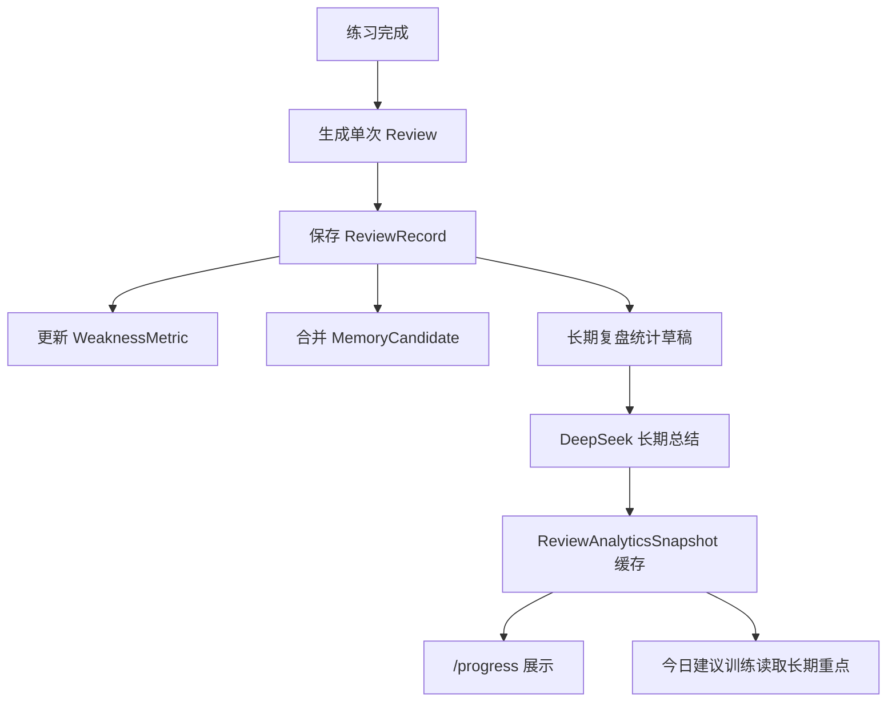

# 单次练习复盘第二阶段 SDD

日期：2026-05-24

## 1. 背景

第一阶段已经把一次练习结束后的复盘做成结构化资产：

- `reviewSnapshot`：本次 30 秒复盘结论。
- `sentenceReviews`：逐句精修，包含语法、用词、自然度、亮点、高级词汇和表达库候选。
- `weaknessUpdates`：本次弱项证据。
- `memoryCandidates`：本次可沉淀为长期记忆的候选。

第二阶段要解决的问题是：用户完成多次练习后，系统不能只展示一次次孤立复盘，而要能告诉用户：

1. 这一周、这个月、长期来看，我进步在哪里？
2. 哪些错误是反复出现的？
3. 哪些表达能力已经变强了？
4. 哪些说话习惯应该进入 AI 的长期记忆？
5. 下一阶段最值得练什么？

第二阶段的核心不是增加更多卡片，而是建立“长期复盘统计层”。它要把单次复盘中的句子级信息、弱项、表达库、记忆候选聚合成长期画像，并把这个画像反向用于今日建议、下一次练习和 AI 对话上下文。

## 2. 方案选择

本阶段采用方案 3：确定性统计 + AI 综合总结 + 缓存快照。

### 2.1 备选方案 A：完全前端统计

优点：

- 实现最快。
- 不需要额外 AI 调用。
- 响应速度稳定。

缺点：

- 很难生成像教练一样的长期总结。
- 无法把多个弱项和成长信号综合成自然语言建议。
- 复盘会像数据面板，而不是学习教练。

### 2.2 备选方案 B：完全 AI 生成

优点：

- 总结表达自然。
- 能综合复杂上下文。

缺点：

- 每次打开页面都慢。
- 结果可解释性弱。
- 测试难度高。
- 容易遗漏具体证据。

### 2.3 选定方案 C：确定性统计 + AI 综合总结 + 缓存快照

优点：

- 统计口径稳定，可测试。
- AI 只负责把统计结果转成学习复盘和训练建议。
- 页面可以优先展示缓存结果，加载快。
- 用户点击刷新时才重新计算。
- 后续迁移 Supabase 时，数据边界清晰。

结论：第二阶段所有长期复盘都先由本地统计函数生成结构化 `ReviewAnalyticsDraft`，再交给 DeepSeek 生成 `ReviewAnalyticsSnapshot`。如果 DeepSeek 不可用，系统仍然展示确定性统计结果。

## 3. 第二阶段目标

### 3.1 用户目标

用户进入“复盘”页面后，可以快速看到：

- 近 7 天、近 30 天、全部时间的训练表现。
- 这段时间最常犯的语法、用词、自然度问题。
- 哪些商务表达说得更自然了。
- 哪些高级词汇或表达已经开始复用。
- 哪些弱项相比之前有所改善。
- 系统建议下一阶段练什么，并且可以一键进入对应训练。

### 3.2 产品目标

第二阶段完成后，复盘模块要从“单次复盘页面”升级为“长期学习仪表盘”。

具体目标：

- 支持时间范围切换：近 7 天、近 30 天、全部时间。
- 从历史 Review 中聚合长期弱项、亮点、表达成长和记忆证据。
- DeepSeek 生成长期中文复盘总结。
- 缓存长期复盘结果，避免重复慢加载。
- 用户可以手动刷新长期复盘。
- 长期复盘结果可以影响今日建议训练。
- 记忆沉淀不再只停留在候选展示，而是可以合并、去重、更新重要度。

## 4. 非目标

第二阶段不做以下内容：

- 不做完整 Supabase 迁移。
- 不做复杂图表库接入。
- 不做多人账号体系。
- 不做发音波形或音素级分析。
- 不改 Gemini Live 实时语音链路。
- 不自动保存高敏感记忆。

如果需要持久化，仍沿用当前 in-memory store 的结构扩展。后续 Supabase 迁移时再把 store 替换为数据库实现。

## 5. 产品体验设计

### 5.1 复盘页面信息架构

`/progress` 页面从当前弱项列表升级为五个模块：

1. 长期复盘总览
2. 经常犯的错误
3. 成长亮点
4. 表达与词汇资产
5. 下一阶段训练计划

页面顶部提供时间范围选择：

- 近 7 天
- 近 30 天
- 全部时间

默认进入近 7 天。用户切换时间范围时优先读缓存，缓存不存在才生成。

### 5.2 长期复盘总览

展示内容：

- 中文总评：一句 80 字以内的长期学习总结。
- 训练次数。
- 分析覆盖的 Review 数。
- 主要成长方向。
- 当前最值得优先解决的问题。
- 最近一次生成时间。
- 刷新按钮。

示例：

```text
近 7 天你完成了 6 次练习。整体来看，你已经能更自然地说明 Rokid 的应用场景，但在技术负责人追问部署和安全时，回答仍然偏长，且缺少清晰的下一步推进。
```

### 5.3 经常犯的错误

展示从 `sentenceReviews` 和 `weaknessUpdates` 中聚合的长期问题。

每个错误卡片包含：

- 错误类型：语法、用词、自然度、商务语气、逻辑、回答策略。
- 出现次数。
- 平均严重度。
- 最近一次出现时间。
- 典型原句。
- 推荐改法。
- 对应训练建议。

优先排序规则：

1. 出现次数更多。
2. 平均严重度更高。
3. 最近出现过。
4. 与当前场景包和训练重点更相关。

### 5.4 成长亮点

系统不能只挑错。长期复盘必须肯定用户进步。

成长亮点来自：

- `sentenceReviews.highlights`
- `reviewSnapshot.strengths`
- 严重度下降的 `weaknessUpdates`
- 被多次保存或复用的表达库句子

展示内容：

- 本阶段说得好的地方。
- 证据句子。
- 过去和现在的对比。
- 推荐继续保持的表达习惯。

示例：

```text
你最近更常使用 “pilot scope”“data flow”“workflow fit” 这类商务表达，说明你已经开始从功能介绍转向客户工作流价值。
```

### 5.5 表达与词汇资产

展示长期表达库成长，而不是只展示静态表达库。

内容包括：

- 新增表达数。
- 来自复盘的表达数。
- 高频高级词汇。
- 最近值得复习的表达。
- 可直接用于下一次训练的 3 条句子。

这些内容从 `phrasebookSuggestions`、`sentenceReviews.vocabulary`、`sentenceReviews.phrasebookCandidate` 和已有表达库中聚合。

### 5.6 下一阶段训练计划

系统基于长期统计生成一个可执行训练计划：

- 推荐目标场景。
- 推荐客户角色。
- 推荐 AI 音色风格。
- 训练重点。
- 预计时长。
- 开始训练按钮。

该计划应复用已有“创建一次练习”的配置结构，不创建新的练习类型。

### 5.7 证据展开

长期结论必须可解释。用户点击某个错误或亮点后，应看到证据：

- 关联练习日期。
- 原句。
- 中文意思。
- 当时的升级表达。
- 相关复盘链接。

第二阶段先用折叠区域展示证据，不做复杂抽屉或弹窗。

## 6. 数据模型设计

### 6.1 时间范围

```ts
type ReviewAnalyticsRange = "7d" | "30d" | "all";
```

### 6.2 长期复盘快照

```ts
type ReviewAnalyticsSnapshot = {
  id: string;
  range: ReviewAnalyticsRange;
  generatedAt: string;
  staleAfter: string;
  sourceReviewIds: string[];
  sourceSessionIds: string[];
  trainingCount: number;
  summaryZh: string;
  topGrowthSignals: GrowthSignal[];
  recurringMistakes: RecurringMistake[];
  naturalnessPatterns: NaturalnessPattern[];
  phraseGrowth: PhraseGrowth;
  memoryInsights: MemoryInsight[];
  nextTrainingPlan: NextTrainingPlan;
  aiGenerated: boolean;
};
```

### 6.3 成长信号

```ts
type GrowthSignal = {
  id: string;
  title: string;
  summaryZh: string;
  evidence: string[];
  confidence: number;
};
```

### 6.4 反复错误

```ts
type RecurringMistake = {
  id: string;
  category:
    | "grammar"
    | "word_choice"
    | "naturalness"
    | "conciseness"
    | "business_tone"
    | "logic"
    | "strategy";
  title: string;
  occurrenceCount: number;
  averageSeverity: number;
  lastSeenAt: string;
  examples: {
    reviewId: string;
    sessionId: string;
    original: string;
    correction: string;
    explanationZh: string;
  }[];
  recommendedDrill: string;
};
```

### 6.5 自然度模式

```ts
type NaturalnessPattern = {
  id: string;
  title: string;
  patternZh: string;
  betterExpression: string;
  examples: string[];
};
```

### 6.6 表达成长

```ts
type PhraseGrowth = {
  newPhraseCount: number;
  reviewGeneratedPhraseCount: number;
  vocabularyItems: {
    term: string;
    chinese: string;
    example: string;
    count: number;
  }[];
  reusableSentences: {
    english: string;
    chinese: string;
    useCase: string;
  }[];
};
```

### 6.7 记忆洞察

```ts
type MemoryInsight = {
  id: string;
  type: "new_memory" | "reinforced_memory" | "conflicting_memory" | "stale_memory";
  title: string;
  summaryZh: string;
  evidence: string[];
  action: "keep" | "merge" | "disable" | "review_manually";
};
```

### 6.8 下一阶段训练计划

```ts
type NextTrainingPlan = {
  title: string;
  reasonZh: string;
  goalId: string;
  mode: string;
  personaId: string;
  voicePackId: string;
  materialMode: "recent_material" | "no_material" | "memory_context";
  focusTags: string[];
  estimatedMinutes: number;
};
```

## 7. 架构设计

### 7.1 模块划分

新增或扩展模块：

- `src/lib/validation/review-analytics.ts`
  - 定义长期复盘 schema 和类型。

- `src/lib/progress/review-analytics.ts`
  - 从历史 Review、PracticeSession、WeaknessMetric、Memory 中生成确定性统计草稿。

- `src/lib/ai/long-term-review.ts`
  - 调用 DeepSeek，将统计草稿整理成自然语言长期复盘快照。

- `src/lib/progress/review-analytics-store.ts`
  - 缓存不同时间范围的复盘快照。
  - 支持强制刷新。

- `src/app/api/review-analytics/route.ts`
  - `GET /api/review-analytics?range=7d`
  - `POST /api/review-analytics` 重新生成。

- `src/features/progress/review-analytics-panel.tsx`
  - 渲染长期复盘总览、错误、亮点、表达成长和下一步计划。

- `src/lib/memory/review-memory-consolidation.ts`
  - 将 review memory candidates 合并到长期记忆。
  - 做去重、重要度更新、敏感内容拦截。

### 7.2 数据流



### 7.3 缓存策略

每个时间范围只缓存一份快照：

- `review_analytics_7d`
- `review_analytics_30d`
- `review_analytics_all`

缓存失效条件：

- 用户点击刷新。
- 有新的 ReviewRecord 生成。
- `generatedAt` 超过当天 23:59。

页面默认不阻塞等待 AI：

1. 有缓存：直接展示。
2. 无缓存：先展示确定性统计草稿，再尝试 AI 总结。
3. AI 失败：展示草稿版本，标记 `aiGenerated: false`。

## 8. AI 设计

### 8.1 DeepSeek 输入

DeepSeek 不直接读取完整原始转写。输入应为裁剪后的结构化摘要：

- 时间范围。
- Review 数量。
- 每个 Review 的 `reviewSnapshot`。
- 每个用户句子的 `sentenceReviews` 摘要。
- 弱项历史。
- 表达库候选统计。
- 记忆候选和已保存记忆摘要。

### 8.2 DeepSeek 输出要求

DeepSeek 必须返回严格 JSON：

- `summaryZh`
- `topGrowthSignals`
- `recurringMistakes`
- `naturalnessPatterns`
- `memoryInsights`
- `nextTrainingPlan`

如果模型返回缺字段或非法 JSON，系统抛出 retryable error，并回退到 deterministic draft。

### 8.3 安全边界

- 不在实时语音循环中调用 DeepSeek。
- 不把高敏感材料原文发给 DeepSeek。
- 不存储客户秘密、价格、合同条款、未确认认证。
- 高敏感记忆只进入候选，不自动启用为 AI 记忆。

## 9. 记忆沉淀设计

第一阶段只是展示 memory candidates。第二阶段要做合并和去重。

### 9.1 自动合并规则

当 Review 保存后：

- `enabledForAi: false` 的候选不自动保存。
- `sensitivity: high` 的候选不自动保存。
- 标题和类型相近的候选合并到已有记忆。
- 新证据追加到 summary 中的证据摘要，不保存原始长转写。
- importance 取 max。
- confidence 使用加权平均。

### 9.2 记忆类型映射

- `recurring_error` → `weakness`
- `speaking_pattern` → `speaking_habit`
- `strength` → `learning_preference`
- `learning_preference` → `learning_preference`
- `practice_focus` → `learning_preference`
- `material_context` → `material_context`
- `customer_context` → `customer_context`

### 9.3 用户控制

记忆中心仍保留：

- 开关“用于 AI 练习”。
- 编辑。
- 删除。
- 敏感标签。

第二阶段不绕过用户控制。自动合并只处理低敏感、启用的候选。

## 10. 与今日建议训练的关系

今日建议训练已经可以用 AI 推荐预设包。第二阶段完成后，今日建议输入中应加入：

- 最近 7 天最严重的 1-2 个长期弱项。
- 最近 7 天最明显的成长亮点。
- 长期复盘推荐的 `nextTrainingPlan`。
- 记忆中心中与当前训练重点最相关的记忆。

这样“今日建议你练”不再只根据最近几条数据随机变化，而是围绕长期学习节奏滚动推进。

## 11. 错误处理

### 11.1 数据不足

如果当前时间范围内 Review 数少于 2：

- 展示“数据还不够形成长期趋势”。
- 仍展示已有单次复盘摘要。
- 推荐用户完成 2-3 次练习后再看长期趋势。

### 11.2 AI 生成失败

如果 DeepSeek 超时或返回非法 JSON：

- 使用确定性统计草稿展示。
- UI 标注“基于本地统计生成”。
- 刷新按钮仍可再次尝试。

### 11.3 缓存过期

如果缓存过期：

- 页面先展示旧缓存。
- 后台重新生成。
- 完成后用户刷新页面可看到新结果。

第二阶段先不做前端实时轮询。

## 12. 测试策略

### 12.1 单元测试

- validation schema 能接受完整长期复盘快照。
- deterministic aggregation 能正确统计 recurring mistakes。
- aggregation 能识别成长亮点和表达成长。
- memory consolidation 能合并相似记忆。
- DeepSeek prompt 包含必要字段，且不包含完整原始转写。

### 12.2 API 测试

- `GET /api/review-analytics?range=7d` 返回缓存或生成结果。
- `POST /api/review-analytics` 强制刷新。
- 数据不足时返回 empty state。
- AI 失败时返回 fallback snapshot。

### 12.3 UI 测试

- `/progress` 显示时间范围切换。
- 展示长期总评、经常犯的错误、成长亮点、表达成长、下一阶段训练计划。
- 点击刷新按钮会调用 API。
- 数据不足时展示正确空状态。

### 12.4 回归测试

- 单次 review 页面不被破坏。
- 今日建议训练仍能加载。
- 记忆中心仍能编辑、删除、开关 AI 使用。
- 全量 `npm test`、`npm run typecheck`、`npm run lint`、`npm run build` 通过。

## 13. 验收标准

第二阶段完成后，应满足：

1. 用户可以在复盘页切换 7 天、30 天、全部时间。
2. 系统能基于历史 Review 生成长期中文总结。
3. 系统能列出经常犯的错误，并展示证据句子。
4. 系统能肯定用户说得好的地方和成长点。
5. 系统能展示表达库和高级词汇成长。
6. 系统能把低敏感、启用的记忆候选合并为长期记忆。
7. 今日建议训练可以读取长期复盘推荐的训练计划。
8. DeepSeek 不可用时页面仍能展示本地统计结果。
9. 所有新增行为都有 TDD 测试覆盖。

## 14. 自查结果

- 没有未定义的数据字段：所有新字段都在第 6 节定义。
- 没有与第一阶段冲突：`sentenceReviews` 继续作为长期统计输入，旧 `sentenceUpgrades` 保留兼容。
- 范围可控：本阶段只做长期复盘统计、缓存、展示和记忆合并，不做 Supabase 迁移。
- 可测试：每个关键行为都有单元、API 或 UI 测试入口。
